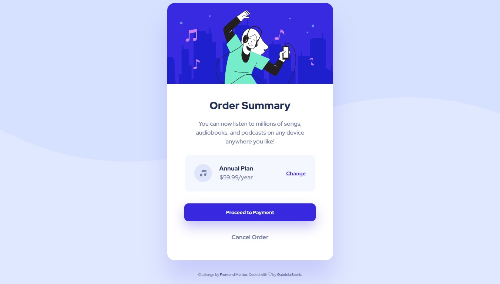

# Frontend Mentor - Order summary card solution

This is a solution to the [Order summary card challenge on Frontend Mentor](https://www.frontendmentor.io/challenges/order-summary-component-QlPmajDUj). Frontend Mentor challenges help you improve your coding skills by building realistic projects. 

## Table of contents

- [Overview](#overview)
  - [The challenge](#the-challenge)
  - [Screenshot](#screenshot)
- [Author](#author)

## Overview

### The challenge

Users should be able to:

- See hover states for interactive elements

### Screenshot

## Author

- GitHub - [Gabriela Sperb](https://github.com/gbspb)
- Frontend Mentor - [@gbspb](https://www.frontendmentor.io/profile/gbspb)
- Instagram - [@gbspb](https://www.instagram.com/gbspb)
